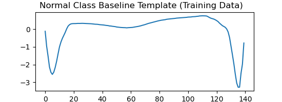
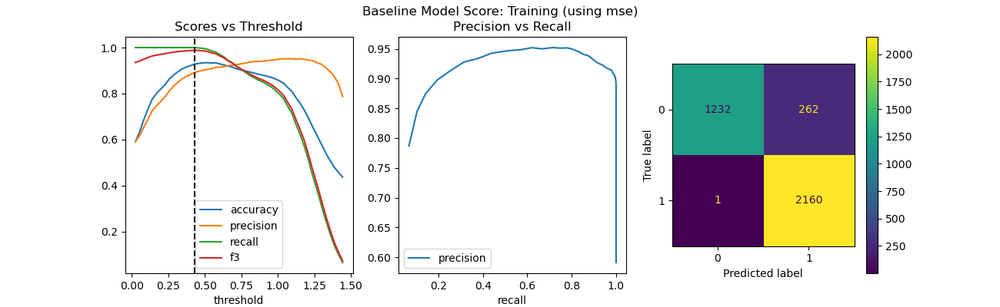
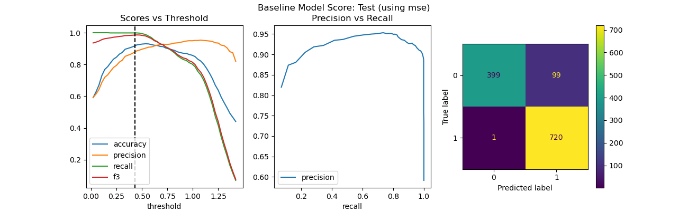
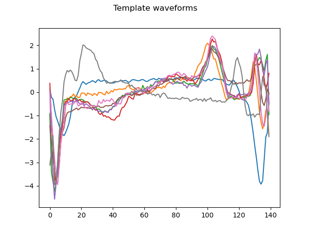
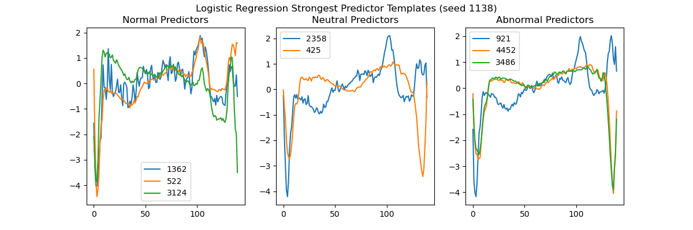

# Classifying Normal and Abnormal Electrocardiagram Waveforms

**Daniel G Kohler**, 09/01/2025

## Executive summary

Several machine learning models are trained on features extracted from Electrocardiogram (ECG) data labeled as Normal and Abnormal. The models are evaluated on training time and F3 score.

Jupyter Notebook: https://github.com/dshavoc/aiml-capstone/blob/master/capstone.ipynb

## Rationale

In 2025 there is momentum to create solutions that empower end users with personalized information so they can take charge of their health before it gets bad.

The ability to automatically detect abnormalities in any bioelectrical signal opens many possibilities. It could be used in devices in the clinic or at home or in implantable medical devices. It could be used to automatically deliver therapy, or to scan and report information to clinicians or end users.

Developing this ability opens up potential for business and better patient outcomes.

## Research Question
* Can an ML model be trained to classify ECG time series data?
* To what level of success using an F3 score? (F-Beta score, where Beta is set to 3. $F_3 = F_\beta | \beta=3$).

## Data Sources

Data was found from Kaggle at https://www.kaggle.com/code/mineshjethva/ecg-anomaly-detection.

Alternate link to the data: http://storage.googleapis.com/download.tensorflow.org/data/ecg.csv.

The data contains 5000 time series of ECG data, labeled as normal or abnormal. Column 140 identifies the class: 0 for Normal, 1 for Abnormal.

## Methodology

1. Exploratory Data Analysis (EDA)
    * Visually inspect the data and attempt to correct any issues observed.
2. Data Cleaning: remove badly spliced waveforms
3. Baseline classification: similarity threshold vs a single Normal class template
4. Feature Engineering
    * Develop algorithm to identify a set of dissimilar ECG waveforms to use as templates
    * Create features for each waveform as a vector of similarity measurements to each template
5. Logistic Regression model
    * Fit model to the extracted features
    * Score the model
    * Explore the templates the model chose as most informative
6. Performance Comparison

## Procedure and Results

### Exploratory Data Analysis

To identify a Normal waveform, it may be useful to identify what a "typical" Normal waveform looks like. For this purpose, the data is split by class, and the waveforms classified as Normal are median-filtered, point-by-point.


**Figure 1: Normal Median Template**

Now compare the similarity of each waveform to this Normal median template and look for anomalies. Similarity metrics used were mean squared error (MSE) and cross correlation coefficient. The following visualization was taken using MSE.


**Figure 2: Visualization of Lowest Similarity Waveforms**

Observations:
* Both the Normal and Abnormal waveforms present in a few distinct forms that seem legitimate, but some look like they were sliced improperly.
    * For example, in the lower left pane (1,0) above, a brown and green waveform show shapes in the middle that appear congruent with the shapes near the beginning in the majority of waveforms, leading to the supposition that those middle-located shapes should have been located near the beginning and were sliced incorrectly.
    * 🚩These badly sliced data would interfere, particularly with the Normal labeled data, and should be removed.
* Some waveforms appear to carry a trend, and may warrant detrending, if possible.
    * 💡This might be done by fitting a linear trend line for each waveform and subtracting it out. But it looks like this could easily add more error than it removes owing to the varying shapes and their amplitudes.

### Data Cleaning

The badly spliced data (false starts) appears to be contained within the first 124 samples, so those are discarded, leaving 4874 waveforms remaining for the test-train split.

### Baseline Model: Median Template Matching / Similarity Threshold vs Class Template

Before feature engineering and ML models are trained, a baseline is established by comparing each waveform against a single median waveform template.

The approach:
1. Compute a baseline template as a point-by-point median filter of the Normal class (y==0) waveforms in the Training set.
2. Split data into Training and Test sets.
3. For each sample in the Training set, compute the similarity to the template.
4. Find a similarity threshold value that optimizes the F3 performance metric.
5. Evaluate the performance on the Test set.



**Figure 3: Normal Class Baseline Template**





**Figure 4: Baseline Model Score (using MSE) (Top: Training; Bottom: Test)**

**Table 1: Baseline Model (using MSE) Score**
```
            Training    Test
Threshold :	0.457		0.457
F3 score  :	0.987		0.986
Accuracy  :	0.931		0.925
Time      : 1.7 s
```

The process was also repeated using the cross correlation coefficient (rather, the inverse thereof, to be consistent with MSE: smaller number is more similar) as a similarity metric with comparable results, but the training time was cut approximately in half.

**Figure 5: Baseline Model Score (using xcor) (Top: Training; Bottom: Test)**

**Table 2: Baseline Model Score (using xcor)**


```
            Training    Test
Threshold :	1.323		1.323
F3 score  :	0.988		0.987
Accuracy  :	0.930		0.924
Time      : 0.70 s
```

### Feature Engineering

The features for modeling are a set of similarity measurements to template waveforms. The template waveforms are selected with preference for dissimilarity as follows:
* Randomly downsample the training set to constrain the search space.
* Randomly select one waveform as a template.
* Include another sample as a template that is the most distinct from each already-accepted template.
* Repeat until a given number of templates have been chosen (selected as 8).

Varying the random seed (affecting only the first selected template), the following are examples of selected templates:




**Figure 6: Visualization of selected templates with different random seeds**

It took about 20 seconds to extract the features.

### Modeling: Logistic Regression

The engineered features are fed into a Logistic Regression model, with 5-fold cross-validation and a small grid search for `C` parameter. The scoring of the model can be found below.

#### Explore the results of the Logistic Regression model

The weights produced were:
```
[-1.17710291, -3.58454648, -1.01623783,  0.30218646, -1.72999853,
  2.97258259,  2.57579714, -4.10404905]
```

The weights are binned as follows:
* Normal templates: Bottom 40% 
* Abnormal templates: Top 40%
* Neutral templates: Middle 20%



**Figure 7: Predictor templates, binned**

#### Observations from Logistic Regression results

* The model predicted with about 98% accuracy and 0.99 F3 score on the Test set.
* The templates that the model chose to predict class are not easily distinguishable by eye. That is, a strong Normal template closely resembles a strong Abnormal template, making it difficult to show examples to a user, despite the strong predictive distinction.

## Results

**Table 2: Model Comparison**

| model_name           |   train_time |   train_acc |   train_f3 |   test_acc |   test_f3 |
|:---------------------|-------------:|------------:|-----------:|-----------:|----------:|
| Baseline (mse)       |       1.8738 |      0.9308 |     0.9873 |     0.9245 |    0.9863 |
| Baseline (xcor)      |       0.8210 |      0.9297 |     0.9875 |     0.9237 |    0.9873 |
| Logistic             |       0.0095 |      0.9852 |     0.9931 |     0.9803 |    0.9900 |
| Logistic (seed 1138) |       0.0230 |      0.9850 |     0.9927 |     0.9795 |    0.9899 |

Observations:
* The baseline model (median template matching) performed almost identically regardless of which similarity metric was used.
* The Logistic Regression model scores significantly higher than the baseline because it is able to match sample waveforms against 8 templates instead of the single median templates, and gains the ability to describe more morphological features.
* There's a distinct difference between training time of the two represented Logistic models, but they should be approximately the same.
    * Author's Note: I will repeat these measurements in the second Capstone submission, but I'm out of time for the first submission.

## Next steps
* Try de-trending the input waveforms
* Try extracting features based on Dynamic Time Warping as a similarity metric
* Try other classification models on the extracted features:
    * K-Nearest Neighbors
    * Support Vector Classifier: linear and radial kernels
    * Decision Tree
    * Neural Network
* Try a deep neural network on the cleaned time-series data
* Quantitative research into the cost of false positives and false negatives to better inform the success metric (tune $\beta$ in the $F_\beta$ score).


## Contact and Further Information
TBD